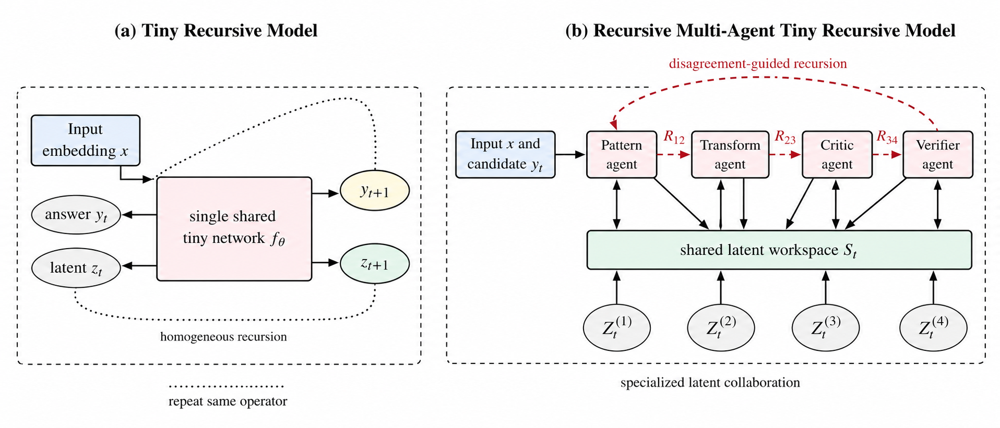
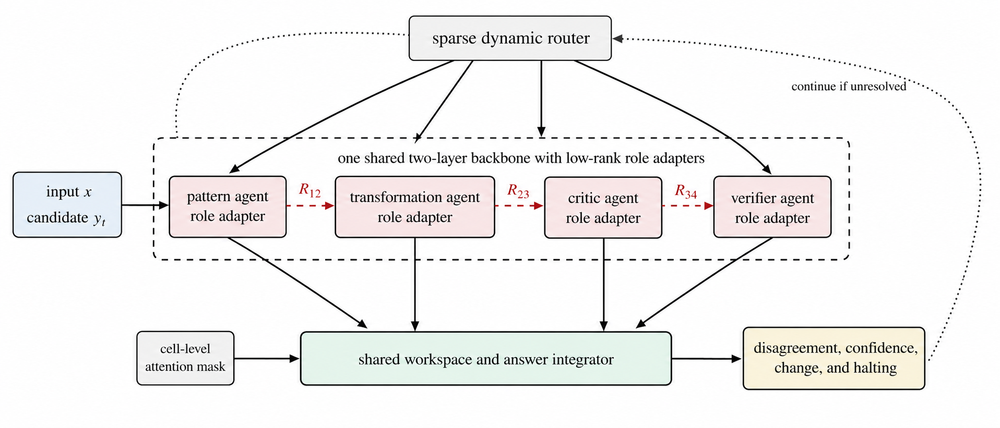

# MA-TRM: Recursive Multi-Agent Tiny Recursive Models

[](https://github.com/PanasheC/MA-TRM/actions/workflows/tests.yml)
[](LICENSE)
[](#parameter-budget)

**MA-TRM** is a parameter-controlled extension of the Tiny Recursive Model. Several tiny specialized reasoners collaboratively refine the same structured solution through continuous latent states. The recommended **MA-TRM-Lite** configuration uses one shared two-layer backbone, four role-conditioned low-rank adapters, private role states, low-rank RecursiveLinks, a shared latent workspace, sparse dynamic routing, cell-level recursive attention, and disagreement-aware adaptive recursion.

This repository preserves the original TRM data pipeline, evaluator interface, ACT wrapper, optimizer integration, and baseline implementation. It therefore supports direct parameter-matched and compute-matched comparisons between TRM and MA-TRM.

<p align="center">
  
</p>

## Abstract

Tiny recursive models show that a compact network can solve difficult structured reasoning tasks by repeatedly refining a latent state and a candidate answer. Their homogeneous recursion, however, applies the same transformation at every reasoning step, provides limited mechanisms for functional specialization, and may spend equal computation on easy and difficult instances. This work proposes a recursive multi-agent tiny recursive model in which several tiny specialized reasoners collaborate through continuous latent representations. The framework replaces a single recursive network with role-conditioned agents, introduces private agent states and a shared workspace, uses residual latent links for communication, and allocates additional recursion when agent predictions disagree. Sparse routing activates only the agents required by the current state, while cell-level recursive attention concentrates updates on uncertain output locations. Four collaboration topologies are implemented, namely sequential, mixture, deliberation, and distillation. An inner-outer optimization procedure assigns local role competence and global system credit. A composite objective balances answer accuracy, iterative improvement, verification, specialization, consensus, routing balance, computation, and halting. The recommended MA-TRM-Lite architecture preserves a shared two-layer backbone and adds low-rank role adapters, lightweight latent links, a verifier, and a dynamic router. The codebase provides parameter and computation accounting, deterministic tests, environment capture, benchmark manifests, and controlled TRM baselines. It does not claim empirical superiority before parameter-matched and compute-matched evaluation.

## Main architecture

MA-TRM maintains an input embedding \(X\), a candidate answer representation \(Y_t\), private role states \(Z_t^{(i)}\), and a shared workspace \(S_t\). For active agent \(i\), the local update is

$$
\widetilde{Z}_{t+1}^{(i)} = A_i\left(X, Y_t, Z_t^{(i)}, S_t\right).
$$

A low-rank residual RecursiveLink communicates the hidden state without decoding an intermediate answer:

$$
R_i(h) = h + \sigma\left(g_i(h)\right)W_{i,\mathrm{up}}\,\mathrm{SiLU}\left(W_{i,\mathrm{down}}\,\mathrm{RMSNorm}(h)\right).
$$

The shared workspace aggregates active messages with router weights \(\alpha_t^{(i)}\):

$$
\bar{H}_{t+1}=\sum_{i\in\mathcal{A}_t}\alpha_t^{(i)}R_i\left(\widetilde{Z}_{t+1}^{(i)}\right),
$$

$$
S_{t+1}=\mathrm{RMSNorm}\left(S_t+\gamma_t\odot\bar{H}_{t+1}\right).
$$

The router selects a top-k role subset:

$$
\mathcal{A}_t=\operatorname{TopK}\left(\operatorname{softmax}(r_\phi(\operatorname{Pool}(S_t))),k\right),
$$

with the verifier always active. During distributed training, the code computes all roles and applies a straight-through top-k mask. During evaluation, `physical_sparse_eval=true` applies one batch-level top-k mask and executes only those selected roles.

### Disagreement-driven recursion

Each active role produces a categorical distribution \(P_t^{(i)}\). The model computes Jensen-Shannon disagreement:

$$
D_t = \frac{1}{|\mathcal{A}_t|}\sum_{i\in\mathcal{A}_t}
\operatorname{KL}\left(P_t^{(i)}\middle\|\bar{P}_t\right),
\qquad
\bar{P}_t=\frac{1}{|\mathcal{A}_t|}\sum_{i\in\mathcal{A}_t}P_t^{(i)}.
$$

The ACT wrapper halts only when the quality head supports completion, disagreement is below its threshold, the categorical answer is stable, and the minimum number of steps has been reached. Evaluation uses batch-level halting by default so the inherited ACT loop never restarts completed samples while other samples are still active.

### Cell-level recursive attention

For cell \(q\), normalized predictive entropy defines uncertainty \(u_{t,q}\). Training uses a soft mask and inference uses a hard mask:

$$
m_{t,q}=\operatorname{sigmoid}\left(\frac{u_{t,q}-\tau_u}{T_u}\right),
$$

$$
Z_{t+1,q}=m_{t,q}\widetilde{Z}_{t+1,q}+(1-m_{t,q})Z_{t,q}.
$$

Periodic global refresh rounds set every mask value to one so that early local errors cannot permanently isolate a cell.

<p align="center">
  
</p>

## Four collaboration topologies

| Topology | Execution pattern | Intended use |
|---|---|---|
| `sequential` | Role messages pass through an ordered latent chain | Recommended MA-TRM-Lite baseline |
| `mixture` | Active roles process one workspace in parallel, then aggregate | Parallel hypothesis generation |
| `deliberation` | Proposal roles run first, followed by critic and verifier stages | Contradiction-sensitive tasks |
| `distillation` | Teacher roles collaborate before a student role update | Compact deployment studies |

The topology interface lives in `models/collaboration/`. Every topology uses the same role states, router, RecursiveLink, workspace, and output heads.

## Composite training objective

The loss head implements

$$
\mathcal{L}=\mathcal{L}_{\mathrm{ans}}
+\lambda_h\mathcal{L}_{\mathrm{halt}}
+\lambda_v\mathcal{L}_{\mathrm{verify}}
+\lambda_i\mathcal{L}_{\mathrm{improve}}
+\lambda_c\mathcal{L}_{\mathrm{cons}}
+\lambda_d\mathcal{L}_{\mathrm{div}}
+\lambda_b\mathcal{L}_{\mathrm{balance}}
+\lambda_e\mathcal{L}_{\mathrm{compute}}
+\lambda_k\mathcal{L}_{\mathrm{distill}}.
$$

The default weights are conservative starting values. All terms, router statistics, active role counts, cell mask fractions, answer changes, disagreement, and adaptive steps are logged through the existing training metrics interface.

## Theorem and proposition summary

### 1. Parameter overhead

For a shared backbone with \(P_\Theta\) parameters, \(M\) roles, \(L_b\) adapted layers, hidden width \(d\), adapter rank \(r_a\), \(E\) latent links, and link rank \(r_\ell\),

$$
P_{\mathrm{MA\text{-}TRM}}=P_\Theta+2ML_bdr_a+2Edr_\ell+P_{\mathrm{ctrl}}.
$$

When \(r_a,r_\ell=o(d)\) and \(M,E,L_b\) remain fixed, the added role and link parameters are lower order than a dense backbone whose layers scale as \(\Omega(L_bd^2)\).

### 2. Sparse round cost

If one agent evaluation costs \(C_A\), one latent link costs \(C_R\), the controllers cost \(C_C\), and round \(t\) activates \(k_t\) roles, then

$$
C_{\mathrm{MA\text{-}TRM}}=\sum_{t=1}^{T}\left(k_tC_A+(k_t-1)C_R+C_C\right).
$$

The dominant active-agent computation relative to a dense \(M\)-role execution is \(\sum_t k_t/(TM)\).

### 3. Latent projection saving

A low-rank latent handoff costs \(O(Ldr_\ell)\), while a full class-space decode costs \(O(LCd)\). The low-rank learned projection has fewer multiplications when \(r_\ell<C\), subject to hardware and kernel constants.

### 4. Sufficient contraction condition

Let \(\Phi\) be one complete collaboration-round map on the joint state. If each active agent and link is Lipschitz continuous, workspace aggregation is nonexpansive, and every active path has a product Lipschitz constant at most \(\kappa<1\), then

$$
\|\Phi(\mathcal{S})-\Phi(\mathcal{S}')\|\leq\kappa\|\mathcal{S}-\mathcal{S}'\|.
$$

Repeated rounds converge to a unique fixed state by the Banach fixed-point theorem. MA-TRM remains well defined without this sufficient condition because recursion is bounded by `halt_max_steps`.

### 5. Expected Hamming error under calibration

If the verifier confidence \(c_{t,q}\) is calibrated for every output cell, then

$$
\mathbb{E}\left[d_H(\hat{y}_t,y^\star)\mid\{c_{t,q}\}\right]
=\sum_{q=1}^{L}(1-c_{t,q}).
$$

The helper `calibrated_expected_hamming_error` implements this quantity. Disagreement is a complementary stability signal, not a correctness certificate.

## Parameter budget

The default 512-wide, two-layer MA-TRM-Lite model has **6,965,598 trainable parameters** for a 12-symbol vocabulary and no puzzle identity table. The equivalent TRM core has **6,829,058 parameters**. The MA-TRM overhead is **136,540 parameters**, approximately **2.00 percent**.

```bash
python scripts/count_parameters.py
```

Abridged expected output:

```json
{
  "TRM_parameters": 6829058,
  "MA_TRM_Lite_parameters": 6965598,
  "absolute_overhead": 136540,
  "relative_overhead_percent": 1.9993972814405736,
  "within_7M_target": true
}
```

The full MA-TRM-Lite parameter breakdown is:

| Component | Parameters |
|---|---:|
| Shared two-layer backbone | 6,815,744 |
| Role adapters | 65,544 |
| Low-rank RecursiveLinks | 34,824 |
| Sparse router | 33,092 |
| Input embedding and answer head | 12,288 |
| Role embeddings | 2,048 |
| Verification and halting heads | 1,545 |
| Shared workspace gate | 513 |
| **Total** | **6,965,598** |

Puzzle identity embeddings in the original pipeline are stored as separately optimized buffers. Benchmark reports must list those buffers separately from trainable network parameters.

## Repository structure

```text
models/
├── agents/                 # role specifications and low-rank adapters
├── collaboration/          # sequential, mixture, deliberation, distillation
├── links/                  # latent RecursiveLink implementations
├── recursive_reasoning/
│   ├── trm.py              # archived TRM baseline
│   └── ma_trm.py           # MA-TRM-Lite model and ACT wrapper
├── halting.py              # disagreement and answer stability
├── routing.py              # straight-through top-k routing
├── shared_workspace.py     # gated workspace and cell attention
├── losses.py               # original TRM loss
└── losses_ma_trm.py        # composite MA-TRM loss

train/
├── phase_control.py        # agents, links, and joint freezing policies
└── train_inner_outer.py    # three-stage co-optimization launcher

scripts/
├── aggregate_metrics.py
├── benchmark_models.py
├── collect_environment.py
├── count_parameters.py
├── create_dataset_manifest.py
├── profile_flops.py
├── run_reproducibility_suite.sh
└── smoke_test.py

config/arch/
├── trm.yaml
├── ma_trm_lite.yaml
├── ma_trm_mixture.yaml
├── ma_trm_deliberation.yaml
└── ma_trm_distillation.yaml
```

## Installation

### Reproducible Conda environment

```bash
conda env create -f environment.yml
conda activate ma-trm
pip install --no-cache-dir --no-build-isolation adam-atan2==0.0.3
```

### Python virtual environment

```bash
python3.10 -m venv .venv
source .venv/bin/activate
python -m pip install --upgrade pip wheel setuptools
pip install torch==2.7.0 --index-url https://download.pytorch.org/whl/cu126
pip install -r requirements-lock.txt
pip install --no-cache-dir --no-build-isolation adam-atan2==0.0.3
```

### Docker

```bash
docker build -t ma-trm:cu126 .
docker run --rm --gpus all -it \
  -v "$PWD/data:/workspace/MA-TRM/data" \
  -v "$PWD/checkpoints:/workspace/MA-TRM/checkpoints" \
  ma-trm:cu126 bash
```

## Dataset preparation

The repository retains the original TRM dataset builders and ARC source files.

```bash
# ARC-AGI-1
python -m dataset.build_arc_dataset \
  --input-file-prefix kaggle/combined/arc-agi \
  --output-dir data/arc1concept-aug-1000 \
  --subsets training evaluation concept \
  --test-set-name evaluation

# ARC-AGI-2
python -m dataset.build_arc_dataset \
  --input-file-prefix kaggle/combined/arc-agi \
  --output-dir data/arc2concept-aug-1000 \
  --subsets training2 evaluation2 concept \
  --test-set-name evaluation2

# Sudoku-Extreme
python dataset/build_sudoku_dataset.py \
  --output-dir data/sudoku-extreme-1k-aug-1000 \
  --subsample-size 1000 \
  --num-aug 1000

# Maze-Hard
python dataset/build_maze_dataset.py
```

Do not train on ARC-AGI-2 training data and then report ARC-AGI-1 evaluation results without a leakage analysis. The source TRM repository notes that the ARC-AGI-2 training collection contains some ARC-AGI-1 evaluation data.

## Training

### MA-TRM-Lite

```bash
export DISABLE_COMPILE=1
run_name="ma_trm_lite_sudoku_seed0"
python pretrain.py \
  arch=ma_trm_lite \
  data_paths="[data/sudoku-extreme-1k-aug-1000]" \
  evaluators="[]" \
  epochs=50000 eval_interval=5000 \
  lr=1e-4 puzzle_emb_lr=1e-4 \
  weight_decay=1.0 puzzle_emb_weight_decay=1.0 \
  arch.mlp_t=true arch.pos_encodings=none \
  arch.L_layers=2 arch.H_cycles=3 arch.L_cycles=2 \
  +run_name=${run_name} ema=true seed=0
```

### Inner-outer co-optimization

```bash
python -m train.train_inner_outer \
  --data-path data/sudoku-extreme-1k-aug-1000 \
  --agents-epochs 10000 \
  --links-epochs 5000 \
  --joint-epochs 20000 \
  --eval-interval 5000 \
  --global-batch-size 768 \
  --seed 0
```

The three phases are:

1. `agents`, train the shared backbone, role adapters, role embeddings, and task heads.
2. `links`, freeze the backbone and train RecursiveLinks, routing, workspace integration, and halting.
3. `joint`, unfreeze the complete system for system-level credit assignment.

### Original TRM baseline

```bash
run_name="trm_sudoku_seed0"
python pretrain.py \
  arch=trm \
  data_paths="[data/sudoku-extreme-1k-aug-1000]" \
  evaluators="[]" \
  epochs=50000 eval_interval=5000 \
  lr=1e-4 puzzle_emb_lr=1e-4 \
  weight_decay=1.0 puzzle_emb_weight_decay=1.0 \
  arch.mlp_t=true arch.pos_encodings=none \
  arch.L_layers=2 arch.H_cycles=3 arch.L_cycles=6 \
  +run_name=${run_name} ema=true seed=0
```

## Reproducibility and benchmarking

Run the complete local validation suite:

```bash
./scripts/run_reproducibility_suite.sh \
  --device cuda \
  --dtype bfloat16 \
  --batch-size 8 \
  --iterations 20
```

It creates:

- `benchmarks/environment.json`, hardware, software, Git, CUDA, and determinism metadata.
- `benchmarks/parameter_budget.json`, exact TRM and MA-TRM parameter counts.
- `benchmarks/synthetic_comparison.json`, one-call latency, throughput, peak GPU memory, and output checksums.
- Pytest results for parameter budget, routing, latent links, all four topologies, sparse execution, loss gradients, phase freezing, disagreement, and deterministic CPU output.

A publication-quality task comparison must report at least:

| Category | Required measurements |
|---|---|
| Quality | exact accuracy, cell accuracy, pass@1, verifier calibration |
| Model size | trainable parameters, puzzle embedding buffers, checkpoint bytes |
| Compute | training FLOPs, inference FLOPs, mean ACT steps, active roles, active cells |
| Systems | wall time, samples per second, peak VRAM, GPU-hours, energy where available |
| Statistics | at least 5 seeds for Sudoku and Maze, at least 3 seeds for full ARC runs |
| Controls | released TRM, parameter-matched TRM, compute-matched TRM, fixed recursion, no links, decoded communication |

See [docs/BENCHMARK_PROTOCOL.md](docs/BENCHMARK_PROTOCOL.md) for the complete protocol.

## Tests

```bash
pytest -q
python scripts/smoke_test.py --topology sequential
python scripts/smoke_test.py --topology mixture
python scripts/smoke_test.py --topology deliberation
python scripts/smoke_test.py --topology distillation
```

The CPU test suite uses reduced widths and sequence lengths. `test_parameter_budget.py` separately instantiates the full 512-wide MA-TRM-Lite configuration and asserts its exact 6,965,598 parameter count.

## Paper

The full Algorithmica-formatted paper and LaTeX source are included in `paper/`:

- [MA_TRM_Algorithmica_Paper.pdf](paper/MA_TRM_Algorithmica_Paper.pdf)
- [MA_TRM_Algorithmica_Paper.tex](paper/MA_TRM_Algorithmica_Paper.tex)

## Attribution

This repository is derived from the MIT-licensed [Samsung SAIL Montreal TinyRecursiveModels repository](https://github.com/samsungsailmontreal/tinyrecursivemodels), which was archived as read-only on 1 April 2026. The original TRM code, dataset builders, evaluators, and baseline configurations retain the original copyright notice.

MA-TRM is informed by the latent collaboration principles described in [Recursive Multi-Agent Systems with Adaptive Collaboration](https://arxiv.org/abs/2604.25917).

## Citation

```bibtex
@article{chiurunge2026matrm,
  title   = {Recursive Multi Agent Tiny Recursive Models for Efficient Latent Space Reasoning},
  author  = {Chiurunge, Panashe},
  journal = {Algorithmica: International Journal of Computational Sciences},
  year    = {2026},
  note    = {Research proposal and reference implementation}
}
```

## License

MIT. See [LICENSE](LICENSE). The original Samsung Electronics copyright and permission notice remain included.
